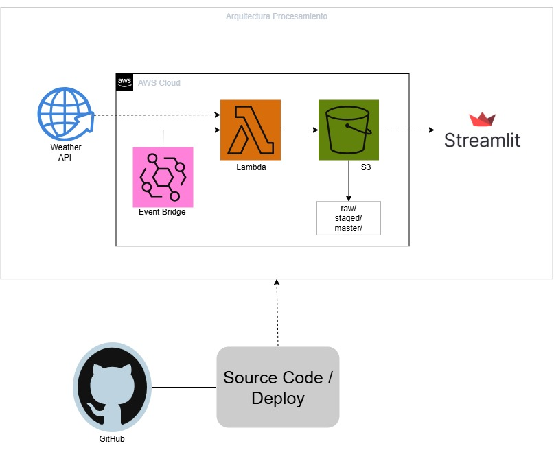

## 🌤️ Weather Medellín ETL

```
Pipeline de Data Engineering desarrollado en Python para la extracción,
 transformación y almacenamiento automatizado de información meteorológica
  de Medellín utilizando WeatherAPI, AWS y Streamlit.

El proyecto implementa un flujo ETL automatizado en la nube, 
almacenando los datos procesados en Amazon S3 y proporcionando un dashboard 
interactivo para su visualización.
```

## 📌 Descripción del proyecto

```
El objetivo del proyecto es construir un pipeline de datos capaz de:

    🌐 Consumir información meteorológica desde WeatherAPI.
    ⚙️ Ejecutar automáticamente el proceso ETL.
    ☁️ Procesar los datos mediante AWS Lambda.
    🗂️ Almacenar la información en Amazon S3.
    📊 Transformar y consolidar los datos meteorológicos.
    📈 Visualizar la información mediante un dashboard desarrollado con Streamlit.
    🔄 Automatizar la ejecución diaria mediante Amazon EventBridge Scheduler.

    El proyecto fue diseñado siguiendo una arquitectura serverless, buscando reducir la necesidad de infraestructura administrada manualmente.
```

## 📁 Estructura
```
WeatherMedellinETL/
│
├── config/
├── dashboard/
│   ├── app.py
│   └── requirements.txt
│
├── src/
│   ├── extract_api.py
│   ├── transform.py
│   ├── load.py
│   ├── s3_utils.py
│   ├── utils.py
│   └── main.py
│
├── docs/
│   └── architecture.png
│
├── requirements.txt
└── README.md
```

## 🏗️ Arquitectura



## 🛠️ Tecnologías

| Categoría | Tecnologías |
| :--- | :--- |
| **Lenguaje** | Python 3.12 |
| **ETL** | Pandas, Requests |
| **Cloud** | AWS Lambda, S3, EventBridge, IAM |
| **Visualización** | Streamlit, Plotly |
| **API** | WeatherAPI |
| **Versionamiento** | Git, GitHub |


## ☁️ Despliegue
```
El pipeline se encuentra desplegado en AWS:

EventBridge Scheduler
        ↓
    AWS Lambda
        ↓
    Amazon S3

El dashboard se encuentra desplegado mediante Streamlit Community Cloud y consulta los datos procesados directamente desde S3.
```


## 📊 Dashboard

**Ver Dashboard en Streamlit :** [](https://weathermedellinetl-egzzpcctkertkpojxuvhko.streamlit.app/)


El dashboard permite visualizar:

    🌡️ Temperatura
    🌧️ Lluvia
    ☔ Probabilidad de lluvia
    📈 Evolución temporal de los datos


## 👨‍💻 Autor

**Alexander Passo**

Data Engineer | Python | AWS | Data Analytics

[](https://github.com/AlexanderPasso)